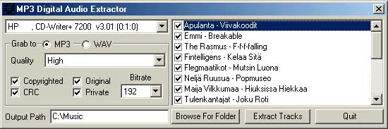



## MP3 Digital Audio Extractor

### Description

Program extracts digitally audio from CD directly to MP3 or WAV format...
 
### More Info
 

             |
---                |---
**Submitted On**   |2001-08-30 21:46:42
**By**             |[Arto Rusanen](https://github.com/Planet-Source-Code/PSCIndex/blob/master/ByAuthor/arto-rusanen.md)
**Level**          |Advanced
**User Rating**    |4.9 (118 globes from 24 users)
**Compatibility**  |VB 6\.0
**Category**       |[Sound/MP3](https://github.com/Planet-Source-Code/PSCIndex/blob/master/ByCategory/sound-mp3__1-45.md)
**World**          |[Visual Basic](https://github.com/Planet-Source-Code/PSCIndex/blob/master/ByWorld/visual-basic.md)
**Archive File**   |[MP3 Digita256668312001\.zip](https://github.com/Planet-Source-Code/arto-rusanen-mp3-digital-audio-extractor__1-26839/archive/master.zip)

